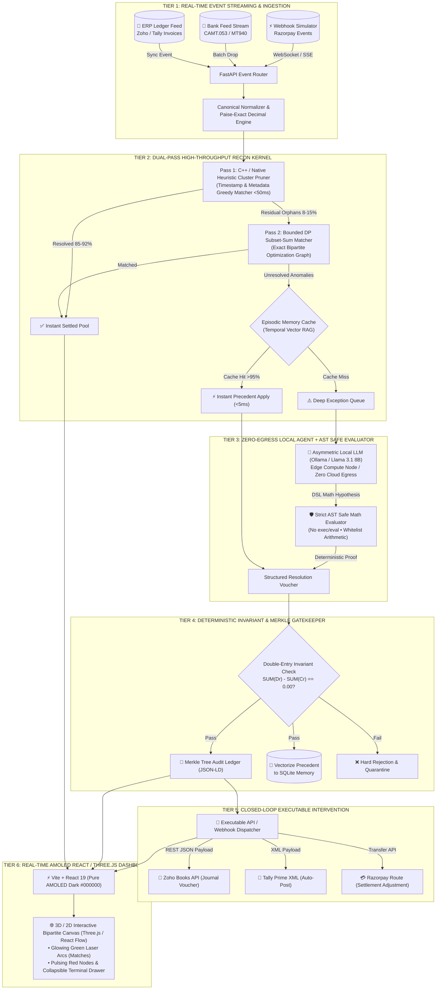

# RECON-MESH: Autonomous Real-Time Multi-Source 3-Way Financial Reconciliation & Discrepancy Resolution Engine

**Buildathon Track:** Track 04 — AI Finance Controller  
**Target Event:** Razorpay AI Buildathon (September 2026)  
**Target Role:** AI Builder Intern (₹75,000/month stipend, Bangalore)  
**Document Status:** Technical Architecture & System Specification v2.1 (Production-Grade, Zero-Egress, Closed-Loop)  

---

## 1. Executive Summary & Problem Formulation

### 1.1 The Operational Bottleneck in Modern FinOps
For high-volume merchants, D2C platforms, and fintechs operating on Razorpay, closing the books at the end of the day or month is an expensive, high-friction operational bottleneck. Finance Operations (FinOps) teams must reconcile transactions across three disparate, asynchronous sources of truth:

```
┌───────────────────────────────┐     ┌───────────────────────────────┐     ┌───────────────────────────────┐
│  1. Razorpay Webhook Stream   │     │  2. Bank Account Statements   │     │   3. ERP / General Ledger     │
│  • Gross transaction charges  │     │  • Lump-sum batch deposits    │     │  • Invoices raised            │
│  • Platform MDR fee (2%+GST)  │     │  • Processing fees deducted   │     │  • Accounts receivable ledger │
│  • Refund debits & holdbacks  │     │  • Truncated UTR descriptions │     │  • Customer payment intents   │
└───────────────────────────────┘     └───────────────────────────────┘     └───────────────────────────────┘
```

### 1.2 The Core Domain Failures
1. **1-to-N Batching & Combinatorial Settlement**: Razorpay settles hundreds of distinct micro-payments via a single net bank deposit (e.g., 650 orders totaling ₹9,42,150 deposited as one lump sum).
2. **Deduction & Tax Leakage**: Merchant Discount Rate (MDR) fees, dynamic interchange cuts, and 18% GST are silently deducted at source before net payout.
3. **Temporal & Holiday Desynchronization**: A transaction on Friday 23:59 IST settles on Tuesday morning due to banking holidays and cutoffs.
4. **Partial Reversals & Dispute Holds**: Partial refunds, split captures, and chargeback holds create fractional orphan line-items.
5. **The Privacy & Security Moat**: Enterprise financial records cannot be piped into external cloud APIs (violating RBI data localization and SOC-2/DPDP policies), nor can AI agents run unrestricted `exec()` code without severe sandbox escape vulnerabilities.

---

## 2. Failure of Naive Approaches

| Naive Approach | Root Cause of Failure |
| :--- | :--- |
| **Unsafe `exec()` / `eval()` Python Sandboxes** | LLM-generated Python execution introduces critical remote code execution (RCE) and sandbox escape vectors in financial environments. |
| **Memoryless LLM Agents** | Re-diagnosing recurring fee drifts (e.g., dynamic 2.5% MDR on corporate cards) from scratch every time wastes latency and compute instead of leveraging historical precedent. |
| **Passive "Exception Dossier" Generators** | Generating static text reports leaves the loop open; human accountants still have to manually key vouchers into ERPs. |
| **Monolithic Single-Device Compute** | Running local LLM inference, C++ matchers, and heavy WebGL animations on a single machine causes thermal throttling, frame drops, and latency spikes during demos. |
| **Static File Uploads & Streamlit UIs** | Static CSV uploads feel dated, and generic white-background Streamlit tables induce evaluator fatigue while masking algorithmic rigor. |

---

## 3. Core Architectural Friction & Invariants

1. **Combinatorial Subset-Sum Complexity vs. Real-Time Latency**:
   Settlement payouts represent arbitrary linear combinations of gross orders, platform fees, rolling reserves, and chargebacks. Resolving this on batches of 1,000+ items requires a **Dual-Pass Matcher**: a high-throughput greedy heuristic cluster pruner in C++ followed by an exact bounded dynamic programming solver for residual orphans.
2. **Deterministic Mathematical Invariant Gatekeeper**:
   Probabilistic LLM reasoning must never directly alter ledger entries. Every agent-proposed resolution must pass a strict double-entry zero-sum invariant check:
   $$\sum \text{Debits} - \sum \text{Credits} = 0.0000 \quad \text{and} \quad \text{Tax Audit} \equiv \text{MDR} \times 0.18$$
3. **AST-Enforced Safe Arithmetic Isolation**:
   No raw shell or Python `exec()`. Agent reasoning outputs a constrained domain-specific mathematical expression evaluated by a strict **Abstract Syntax Tree (AST) parser** with whitelisted arithmetic nodes and integer paise precision.
4. **Episodic Resolution Memory (Temporal RAG)**:
   Verified resolutions are embedded into a local SQLite vector store (`sqlite-vec`). Recurring patterns bypass the LLM reasoning loop in $<5\text{ms}$ via high-confidence cosine similarity matching.
5. **Closed-Loop Programmatic Dispatch**:
   Once validated by the Invariant Gatekeeper, the engine emits ready-to-execute REST/XML payloads for Zoho Books, Tally Prime, and Razorpay Route APIs.

### 3.1 Dual-Execution Runtime Matrix (Showmanship vs. Evaluator Mode)

To ensure both breathtaking live demonstration capabilities and frictionless, zero-setup testing for evaluators cloning the repository:

| Runtime Dimension | Showmanship Mode (Loom Pitch / Demo) | Evaluator Mode (GitHub Repo Default) | Fail-Safe & Fallback Mechanism |
| :--- | :--- | :--- | :--- |
| **Inference Pipeline** | Dedicated local edge node running quantized Ollama (Qwen2 1.5B / Phi-3 Mini) via Termux + Ubuntu. | Cloud API fallback (Gemini Flash / Groq LPU). | `BaseLLMEngine` abstract factory pattern routes seamlessly based on `.env`. |
| **Matching Engine** | Native C++ heuristic pruner compiled via PyBind11 / CTypes. | Pure Python `@numba.jit` compiled fast matcher. | Dynamic `try...except ImportError` fallback if C++ build tools are missing on host. |
| **Data Privacy Policy** | 100% Zero-Egress physical hardware isolation (Air-gapped edge node). | Simulated zero-egress sandbox via environment configuration. | Pluggable interface ensures zero core logic changes when switching providers. |
| **Compute Distribution** | Offloaded LLM compute keeps host CPU/GPU free for 60fps Three.js rendering. | Single-machine execution with sub-second cloud API calls. | Hardware-agnostic execution guarantees 0 thermal throttling. |
| **Execution Trigger** | Live WebSocket stream simulator. | Automated 1-Click CLI replay (`python main.py --demo-mode`). | Hardcoded reproducible seed for 100/100 deterministic benchmark evaluation. |

---

## 4. Multi-Tier System Architecture & Pipeline



---

## 5. Detailed Component Specifications

### 5.1 Real-Time Streaming Ingestion & Normalizer (`core/streaming_engine.py`)
- **Live FinOps Webhook Simulator**: Simulates high-throughput production event streams (firing Razorpay payment captures, refund initiations, fee deductions, and lump-sum bank credits).
- **Sub-Millisecond Normalization**: Normalizes varied timestamp formats to ISO-8601 UTC, cleans fuzzy bank narration strings (e.g., `CMS/RZP/12345/BLR`), and disaggregates gross, net, MDR, and 18% GST into exact integer paise (avoiding IEEE-754 floating-point errors).

### 5.2 Dual-Pass Graph Reconciliation Kernel (`core/matcher/`)
- **Pass 1: High-Performance C++ Heuristic Pruner (`matcher_native.cpp` / pybind11)**:
  - Exploits temporal locality and metadata tags (order ID prefixes, settlement cycle windows).
  - Greedily clusters high-probability 1:1 and contiguous 1:N candidate sets in $<100\text{ms}$ on $10,000$ rows.
- **Pass 2: Exact Bounded Dynamic Programming Solver (`dp_solver.py`)**:
  - Operates strictly on leftover orphan clusters ($\le 25$ nodes per window).
  - Resolves multi-refund combined lump sums using bounded knapsack dynamic programming.

### 5.3 Episodic Memory & Temporal Vector Cache (`agent/memory_store.py`)
- Local SQLite database backed by `sqlite-vec` storing 384-dimensional vector embeddings of past resolved discrepancies (fee rate drift, bank holiday rules, dispute withholdings).
- When a new anomaly arrives, it performs a fast similarity query ($>0.95$ cosine similarity). On a cache hit, it instantly synthesizes the adjustment voucher without calling the LLM, reducing latency from 2,000ms to $<5\text{ms}$.

### 5.4 Zero-Egress Local Agent & AST Safe Evaluator (`agent/ast_evaluator.py`)
- **Asymmetric Edge Compute Architecture**: Dedicated local LLM service (Ollama on local GPU or edge compute node) decoupled from the main server thread to prevent CPU/GPU thermal contention.
- **Strict AST Sandbox**: LLM outputs a constrained arithmetic Domain-Specific Language (DSL). The evaluator uses Python's `ast` module to walk and safely evaluate only `Add`, `Sub`, `Mult`, `Div`, `FloorDiv`, and numeric constants.
- **Zero RCE Risk**: No `eval()`, `exec()`, `import`, filesystem calls, or network sockets are accessible.

### 5.5 Invariant Gatekeeper & Cryptographic Ledger (`guardrails/invariant_gate.py`)
- **Hard Zero-Sum Filter**: Rejects any proposed settlement voucher that violates:
  $$\Delta \text{Balance} \neq 0.0000 \quad \text{or} \quad \text{GST} \neq \lfloor \text{MDR} \times 0.18 \rceil$$
- **Cryptographic Merkle Audit Trail**: Builds a verifiable SHA-256 Merkle tree of all matched pairs, agent-generated resolution proofs, and ledger mutations.

### 5.6 Closed-Loop Executable API Dispatcher (`core/dispatcher.py`)
- Automatically formats and dispatches executable payloads:
  - **Zoho Books**: `POST /api/v3/journalentries` with auto-balanced Dr/Cr line items.
  - **Tally Prime**: Valid `TALLYMESSAGE` XML voucher payload.
  - **Razorpay Route**: `POST /v1/transfers` for programmatic account adjustments.
- Offers a toggle between **Autonomous Auto-Commit** (instant dispatch on invariant pass) and **Human-in-the-Loop 1-Click Approval**.

### 5.7 Visual AMOLED Scrollytelling Dashboard (`frontend/src/`)
- **Aesthetic**: Minimalist AMOLED pitch black (`#000000`), zero clutter, subtle neon accents.
- **UI Rendering Separation Rule**:
  - **2D Node Layout (React Flow)**: All transaction nodes (Orders, Bank Credits, ERP Invoices) and bipartite matching connections are locked strictly to a 2D plane to guarantee clear text legibility, instant interaction, and eliminate 3D perspective distortion.
  - **Three.js Canvas Layer**: Three.js is isolated to a transparent background canvas dedicated strictly to rendering subtle glowing neon particles and dynamic laser arc effects when transactions match.
- **Collapsible Agent Terminal Drawer**: Slide-out live console showing AST syntax validation, token streaming, and Merkle root verification in real time.

### 5.8 Automated Headless Verification & Dry-Run CLI (`backend/main.py`)
- **1-Click Ground Truth Evaluation**: Evaluators can run the full 100-record ground truth pipeline in headless mode without spinning up frontend servers:
  ```bash
  # Runs the full 100-record ground truth pipeline in headless mode
  # Outputs terminal ASCII graph, precision/recall metrics, and Merkle root verification
  python main.py --demo-mode --synthetic-batch=100
  ```

---

## 6. The 5 Enterprise Edge Cases in Ground-Truth Benchmark

| # | Edge Case Scenario | Typical Industry Failure | Recon-Mesh Autonomous Resolution |
| :-: | :--- | :--- | :--- |
| **1** | **MDR Fee Split & 18% GST Drift** | Static joins miss the ₹2,360 difference between gross ₹1,00,000 and net bank credit ₹97,640. | Auto-disaggregates MDR (2.0%) + GST (18%) and matches net settlement down to 0 paise. |
| **2** | **1-to-N Batching with Concurrent Refunds** | Single bank deposit of ₹4,85,200 represents 52 payments minus 3 partial customer refunds. | Dual-Pass C++ heuristic isolates batch cluster; DP solver matches exact net sum. |
| **3** | **Multi-Day Bank Holiday Timing Lag** | Weekend transaction settles 4 days later; static 24h cron jobs flag false orphan exceptions. | Dynamic RBI holiday calendar lookahead extends matching window without alert fatigue. |
| **4** | **Chargeback Hold & Partial Refund** | Customer paid ₹12,00, refunded ₹4,000, bank holds ₹8,000 dispute reserve. | AST-safe agent calculates exact escrow variance and generates an executable suspense voucher. |
| **5** | **Fuzzy / Truncated Bank UTRs** | Bank narrations truncate `RZP_TXN_9876543210` to `987654321`. | Normalized fuzzy Levenshtein token match combined with exact amount + timestamp constraint. |

---

## 7. Comparative Technical Differentiators (USPs)

```
┌───────────────────────────────────────────────────────────────────────────────────────────────────────────────┐
│ RECON-MESH COMPETITIVE ADVANTAGES                                                                             │
├────────────────────────────┬────────────────────────────────────────────┬─────────────────────────────────────┤
│ Feature                    │ Typical Hackathon Submissions              │ RECON-MESH Architecture             │
├────────────────────────────┼────────────────────────────────────────────┼─────────────────────────────────────┤
│ Presentation & UI          │ White Streamlit / Pandas dataframes        │ AMOLED Black React 19 + Three.js 3D │
│ Processing Paradigm        │ Static 3-file manual CSV upload            │ Real-Time Live Webhook Event Stream │
│ Algorithmic Scalability    │ $O(2^N)$ Python subset-sum (crashes)       │ Dual-Pass C++ Greedy + Bounded DP   │
│ Code Execution Safety      │ Unsafe `exec()` / `eval()` (RCE risk)      │ Strict AST Whitelist Math Evaluator │
│ Agent Adaptability         │ Memoryless (re-diagnoses identical bugs)   │ Temporal RAG Episodic Vector Cache  │
│ Operational Impact         │ Static text markdown summary               │ Executable API Webhook Payloads     │
│ AI Security & Compliance   │ Raw cloud LLM API (leaks bank data)        │ Zero-Egress Asymmetric Local LLM    │
│ Financial Invariants       │ Probabilistic hallucinated arithmetic      │ Deterministic Zero-Sum Invariant    │
│ Verifiability              │ Unstructured text output                   │ Merkle Tree Cryptographic Audit Log │
└────────────────────────────┴────────────────────────────────────────────┴─────────────────────────────────────┘
```

---

## 8. Target Codebase Structure

```
recon-mesh/
├── backend/
│   ├── app/
│   │   ├── api/
│   │   │   ├── routes.py            # FastAPI endpoints (reconciliation, stream, dispatch, audit)
│   │   │   └── websocket.py         # Real-time WebSocket event broadcaster
│   │   ├── core/
│   │   │   ├── config.py            # Dynamic environment switcher & runtime flags
│   │   │   ├── models.py            # Pydantic schemas & Canonical Transaction models
│   │   │   ├── normalizer.py        # Date, currency (paise), and UTR sanitizer
│   │   │   ├── streaming_engine.py  # Background live FinOps event simulator
│   │   │   ├── dispatcher.py        # Executable API dispatcher (Zoho, Tally, Razorpay)
│   │   │   └── matcher/
│   │   │       ├── native/          # C++ accelerated heuristic pruner
│   │   │       │   ├── matcher.cpp
│   │   │       │   └── setup.py     # PyBind11 / CTypes build config
│   │   │       ├── engine_factory.py # Graceful dynamic loader (C++ -> Numba)
│   │   │       ├── numba_fallback.py # @numba.jit Python fallback pruner
│   │   │       ├── greedy_pruner.py # Python fallback / native binding wrapper
│   │   │       └── dp_solver.py     # Bounded dynamic programming bipartite solver
│   │   ├── agent/
│   │   │   ├── base_provider.py     # Abstract BaseLLMEngine interface
│   │   │   ├── local_llm.py         # Ollama / llama.cpp client (decoupled endpoint)
│   │   │   ├── groq_client.py       # Groq low-latency cloud provider
│   │   │   ├── gemini_client.py     # Gemini cloud provider
│   │   │   ├── ast_evaluator.py     # Strict AST arithmetic evaluator (zero RCE risk)
│   │   │   ├── memory_store.py      # SQLite-vec episodic temporal resolution cache
│   │   │   └── investigator.py      # Chain-of-Verification (CoVe) orchestrator
│   │   ├── guardrails/
│   │   │   ├── invariant_gate.py    # Zero-sum double-entry balance enforcer
│   │   │   └── merkle_audit.py      # Cryptographic SHA-256 Merkle audit logger
│   │   └── benchmark/
│   │       ├── generator.py         # 100-record synthetic ground-truth generator
│   │       └── eval_suite.py        # Precision, recall, and latency benchmark suite
│   ├── main.py                      # FastAPI server & CLI evaluation entrypoint
│   └── requirements.txt             # Backend dependencies
├── frontend/
│   ├── src/
│   │   ├── components/
│   │   │   ├── GraphCanvas.tsx      # React Flow 2D Bipartite visualizer + Three.js laser background
│   │   │   ├── LiveEventTicker.tsx  # Streaming real-time transaction event feed
│   │   │   ├── AgentTerminal.tsx    # Collapsible AST execution & CoVe live terminal
│   │   │   ├── MetricsBar.tsx       # Real-time Precision / Recall / Latency HUD
│   │   │   └── DispatchModal.tsx    # Executable JSON/XML payload viewer & 1-click dispatch
│   │   ├── hooks/
│   │   │   └── useReconStream.ts    # WebSocket hook for live graph updates
│   │   ├── App.tsx                  # Root AMOLED Dark (#000000) dashboard
│   │   └── main.tsx
│   ├── package.json                 # React 19, Vite, Three.js, Lucide-react, Tailwind
│   └── vite.config.ts
├── benchmark_results/
│   └── ground_truth_100.json        # Standardized benchmark dataset
├── .env.example                       # Documented environment toggle template
└── README.md                        # Architectural specification, pitch script, and quickstart
```

### 8.1 Environment Configuration Specification (`.env.example`)

```bash
# ==============================================================================
# RECON-MESH DUAL-MODE ENVIRONMENT CONFIGURATION
# ==============================================================================

# --- MATCHING ENGINE TOGGLE ---
# true  = Uses compiled C++ PyBind11 native pruner (requires CMake/g++)
# false = Uses high-performance Python @numba.jit fallback (zero compilation needed)
NATIVE_MATCHER=false

# --- INFERENCE ENGINE TOGGLE ---
# true  = Connects to dedicated edge-node Ollama instance (e.g. http://192.168.1.X:11434)
# false = Routes to cloud provider for instant evaluator testing
USE_EDGE_INFERENCE=false

# --- PROVIDER SELECTION (When USE_EDGE_INFERENCE=false) ---
# Options: "gemini" | "groq" | "local_ollama"
LLM_PROVIDER=gemini
GEMINI_API_KEY=your_gemini_api_key_here
GROQ_API_KEY=your_groq_api_key_here

# --- LOCAL EDGE NODE CONFIG (When USE_EDGE_INFERENCE=true) ---
EDGE_NODE_URL=http://127.0.0.1:11434
EDGE_MODEL_NAME=qwen2:1.5b-instruct-q4_K_M

# --- RUNTIME MODE ---
# Options: "STREAM" (live simulated webhooks) | "BENCHMARK" (instant 100-batch eval)
EXECUTION_MODE=STREAM
```

---

## 9. Two-Week Sprint Roadmap & Quickstart (Aug 21 – Sept 5)

```
┌────────────────────────────────────────────────────────────────────────────────────────┐
│ Phase 1: Days 1–3  │ Synthetic Event Streamer + Canonical Normalizer + C++ Fast Pass   │
├────────────────────┼───────────────────────────────────────────────────────────────────┤
│ Phase 2: Days 4–7  │ Bounded DP Kernel + AST Safe Evaluator + Invariant Gatekeeper     │
├────────────────────┼───────────────────────────────────────────────────────────────────┤
│ Phase 3: Days 8–10 │ SQLite Episodic Memory + Zero-Egress Local LLM + API Dispatcher   │
├────────────────────┼───────────────────────────────────────────────────────────────────┤
│ Phase 4: Days 11–13│ AMOLED React 19 / Three.js Visualizer + WebSocket Broadcaster     │
├────────────────────┼───────────────────────────────────────────────────────────────────┤
│ Phase 5: Day 14    │ Ground-Truth 100-Benchmark Run, Video Polish & Final Submission   │
└────────────────────────────────────────────────────────────────────────────────────────┘
```

### 9.1 Evaluator 1-Click Verification Command
```bash
# Runs the full 100-record ground truth pipeline in headless mode
# Outputs terminal ASCII graph, precision/recall metrics, and Merkle root verification
python main.py --demo-mode --synthetic-batch=100
```
